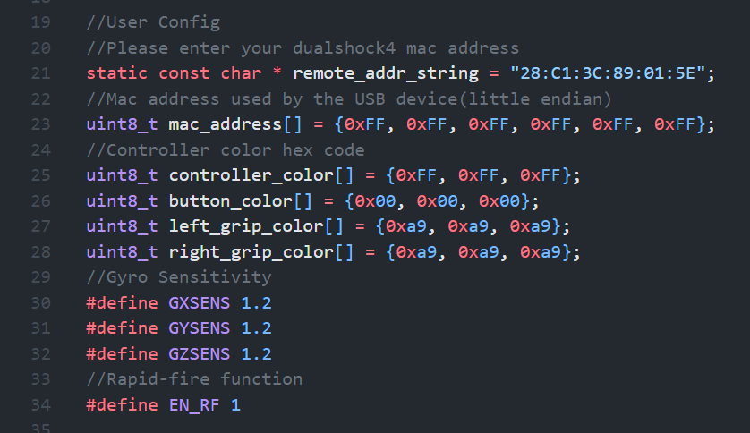
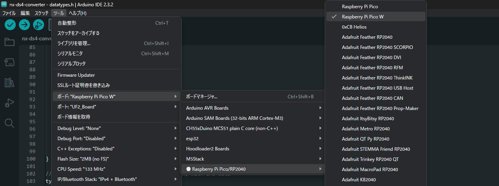
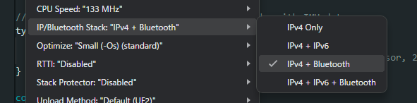
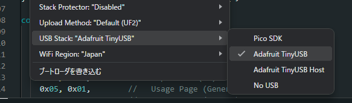

# nx-ds4-converter
Raspberrypi pico W用dualshock4 to Nintendo Switch Pro Controllerコンバータ

## 使用方法
arduino IDEとarduino-pico(earlephilhower版)を導入してください。

https://github.com/earlephilhower/arduino-pico

本リポジトリをダウンロードし、arduino IDEで.inoファイルを開きます。

**remote_addr_stringを必ずお持ちのdualshock4のmacアドレスに変更してください。**

ボードとコンパイルオプションは以下の3点に気を付けてください。

コンパイル・書き込みが終わったらdualshock4のSHARE+PSボタンを同時押しし、LEDの点滅中にpico WをNintendo Switchに挿すと動かせるようになります。

## inplemention
- [x] ジャイロ
- [x] ZR連射(L+ZRで連射になります。)
- [ ] 振動
### スペシャルサンクス
https://github.com/dekuNukem/Nintendo_Switch_Reverse_Engineering

https://github.com/hisptoot/GIMX-firmwares/tree/master/EMUSWITCH

https://www.mzyy94.com/blog/2020/03/20/nintendo-switch-pro-controller-usb-gadget/
